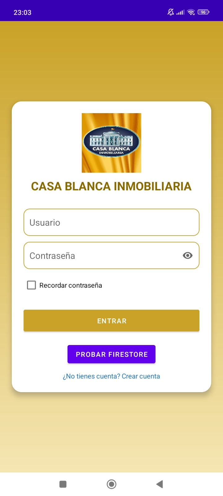
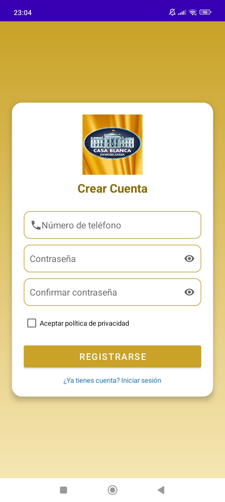
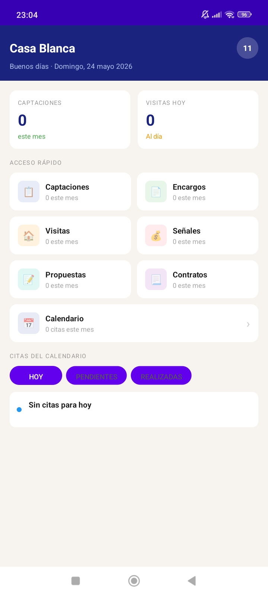
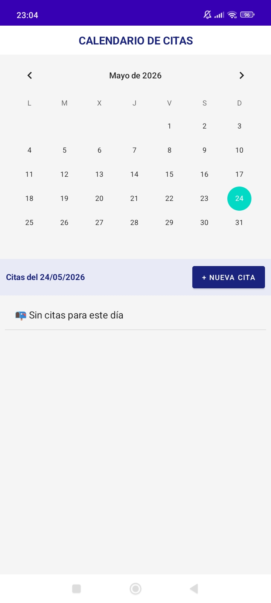
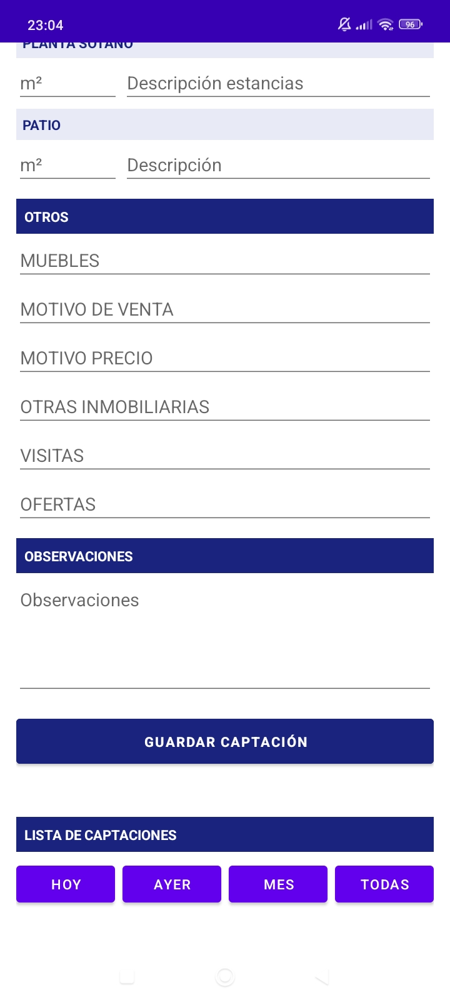
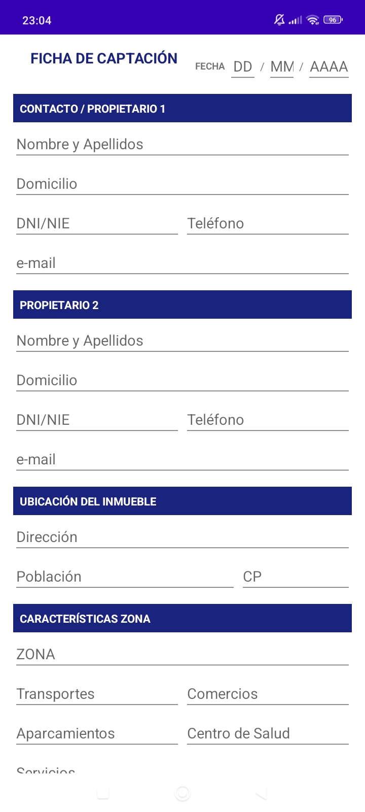
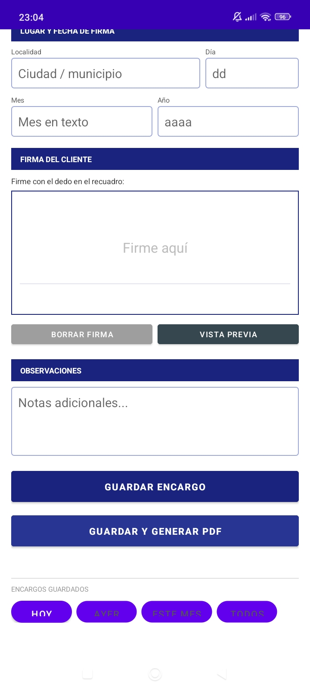

# CasaBlanca Inmobiliaria — App Android

App Android nativa de gestión operativa para equipo inmobiliario en campo.
Desarrollada durante prácticas en CasaBlanca Inmobiliaria (marzo–mayo 2026).

## ¿Qué problema resuelve?
El equipo comercial gestionaba visitas, captaciones, ventas y contratos
en papel. Esta app digitaliza el 100% de ese flujo desde el móvil.

## Funcionalidades
- Login con Firebase Authentication y sistema de roles por perfil
- Gestión de visitas, captaciones, ventas y contratos desde el móvil
- Generación automática de PDFs con datos del formulario
- Firma electrónica integrada y cumplimiento RGPD
- Sincronización de tareas y recordatorios con Google Calendar
- Subida y gestión de imágenes y documentos
- Consumo de APIs REST para sincronización de datos

## Tecnologías
| Área | Tecnología |
|------|-----------|
| Lenguaje | Java, Kotlin |
| Base de datos | Firebase Firestore |
| Autenticación | Firebase Authentication |
| APIs | REST API, JSON |
| Documentos | Generación de PDFs con firma digital |
| Control de versiones | Git, GitHub |

## Resultado
Eliminación del 100% del papeleo manual en los procesos clave.
El equipo comercial opera ahora completamente desde el móvil.

## Capturas

